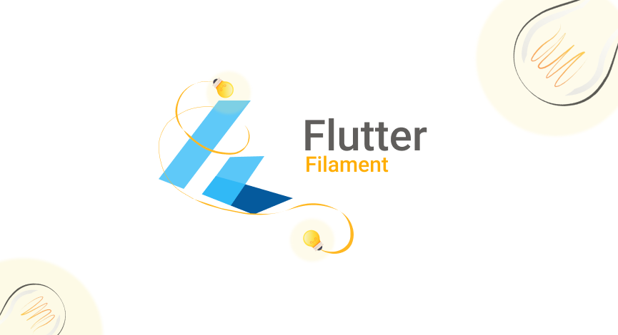

# interactive_3d [](https://pub.dev/packages/interactive_3d)



`interactive_3d` is an open-source Flutter plugin for rendering interactive 3d models `.glb` or `.gltf` using the Filament Engine. Currently supported only on Android. The code is available open-source with MIT license, your contribution to this would highly be appreciated.

> Mainly inspired having healthcare problem in mind, to have a 3D model from where users can interact with the model and describe their complaints about any part of the body, specific or full human body. I want to take it to the next level with the help of **YOU** 🫵 and the great **Flutter community** 💙.

## Features

✅  Render 3D models of type `.glb` and `.gltf`.

✅  Interactive gestures to rotate, pan, and tap on models.

✅  Extract data from interactions and use it in your flutter app.

## Demo

<p float="left">
 
 
 
</p>

## Bugs
🪲 PlatformView (Flutter Embedded) & SurfaceView (Android) lifecycle conflicts and leading to model don't load back when taking app to background (Paused) and bringing back to foreground (Resumed) states, this is the main bug I'm actively working on. [Explore Bug](https://medium.com/@ak187429/every-innovation-is-an-idea-before-it-turns-into-reality-6547e47ca23f)

🪲 IBL and SKYBOX background view not changing from the path provided on Flutter side, this one is currently not in my priority list because there are other major ones I'm already working on, if you've time you can check into this one too.

## Future features
I'm actively working on this plugin and currently focusing mainly on Android. Below mentioned features will be added, if you have something great in mind and want to contribute, MOST WELCOME 🤗

🚀 Add horizontal scroll indicators to hide or show specific parts of the model.

🚀 Optimize performance and fix existing bugs.

## Installation

Add interactive_3d: latest_version to your **pubspec.yaml** and then import it.

```dartimport 'package:interactive_3d/interactive_3d.dart';```

## How to use

Add your model files in `assets/models` to your project of type `.glb` or `.gltf` and configure `pubspec.yaml` assets. If you have a `.glb` model then you're lucky 😄 because it doesn't require external resources to be configured but `.gltf` does. So, if you've a `.gltf` model then place `.bin` file in the same directory `assets/models` that's it. In case if you've textures too, then add another sub-directory to the models directory, for example, `assets/models/textures` and add all your texture images here and make sure your `.bin` file is on top of the list of the resources that's it. You can also view example project assets structure if you're still confused. 

Lastly, if you're loading `.gltf` do the following:

```dart
Interactive3d(
                modelPath: 'assets/models/Tooth-2.gltf',
                // ibl and skybox are background envs
                iblPath: 'assets/models/venetian_crossroads_2k_ibl.ktx',
                skyboxPath: 'assets/models/venetian_crossroads_2k_skybox.ktx',
                resources: [
                  'scene.bin',
                  'textures/mouth_baseColor.png',
                  'textures/mouth_metallicRoughness.png',
                  'textures/mouth_normal.png',
                  'textures/teeth_baseColor.png',
                  'textures/teeth_metallicRoughness.png',
                  'textures/teeth_normal.png',
                ],
                onSelectionChanged: (selectedEntities) {
                  setState(() {
                    _selectedEntities = selectedEntities;
                  });
                },
              )
```

and if you're loading `.glb` then resources is not necessary just do the following:

```dart
Interactive3d(
                modelPath: 'assets/models/heart.glb',
                // ibl and skybox are background envs
                iblPath: 'assets/models/venetian_crossroads_2k_ibl.ktx',
                skyboxPath: 'assets/models/venetian_crossroads_2k_skybox.ktx',
                onSelectionChanged: (selectedEntities) {
                  setState(() {
                    _selectedEntities = selectedEntities;
                  });
                },
              )
```

For more information : visit example project.

## Must read

If you're willing to contribute feel free to create issue and rasie a PR. Make sure you inform me through my [LinkedIn DM](https://www.linkedin.com/in/muhammad-adnan-developer/)  for the issues you create in both cases either or not if you want to contribute.

This plugin will be improved more along the time, your contribution will be very invaluable.

## Created & Actively Maintained By

[@MuhammadAdnan](https://github.com/AdnanKhan45), LinkedIn  : [@MuhammadAdnan](https://www.linkedin.com/in/muhammad-adnan-developer/) , Instagram  : [@MuhammadAdnan](https://www.instagram.com/dev.adnankhan/).

YouTube : [@eTechViral](https://www.youtube.com/c/eTechViral)

