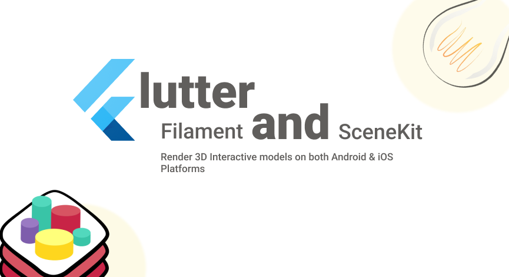

# interactive_3d [](https://pub.dev/packages/interactive_3d)



`interactive_3d` is an open-source Flutter plugin for rendering interactive 3d models `.glb` or `.gltf` using the Filament Engine on Android & SceneKit on iOS. The code is available open-source with MIT license.

> Mainly inspired having healthcare problem in mind, to have a 3D model from where users can interact with the model and describe their complaints about any part of the body, specific or full human body.

## Features

✅ Render 3D models of type `.glb` and `.gltf` from both (assets & network).

✅ Load models background environments ibl and skybox `.ktx` files.

✅ Interactive gestures to rotate, pan, and tap on models.

✅ Change selected and preselected colors of any part using name.

✅ Update default zoom.

✅ Extract data from interactions and use it in your flutter app.

✅ Update Visibility of different parts of Model.

## Generate IBL & Skybox

IBL captures the lighting environment from an HDR image, providing indirect lighting information for reflections and ambient light. The Skybox defines the scene's background, simulating the surrounding environment. To generate these, acquire a high-quality HDR image from [Poly Haven](https://polyhaven.com/) or some other website. Download Filament latest build for your OS from [Here](https://github.com/google/filament/releases), open `bin` directory in your terminal or set PATH in your shell to directly use `cmgen`. `cmgen` is a command-line tool provided by the Filament graphics engine. It's specifically designed to generate Image-Based Lighting (IBL) data and skybox textures from high-dynamic-range (HDR) images. Now that `cmgen` is set up, and you have a downloaded `.hdr` file. Run the following command to generate `.ktx` files.

```
cmgen --format=ktx --deploy=output_file_name output_directory
```
For example:
```
cmgen --format=ktx --deploy=san_guiseppe ~/Downloads/san_giuseppe_bridge_4k.hdr 
```

## Demo  (Android & iOS)

<p float="left">  
   
   
   
    
</p>

## Installation

Add interactive_3d: latest_version to your **pubspec.yaml** and then import it.

```dartimport 'package:interactive_3d/interactive_3d.dart';```

## How to use

Add your model files in `assets/models` to your project of type `.glb` or `.gltf` and configure `pubspec.yaml` assets. If you have a `.glb` model then you're lucky 😄 because it doesn't require external resources to be configured but `.gltf` does. So, if you've a `.gltf` model then place `.bin` file in the same directory `assets/models` that's it. In case if you've textures too, then add another sub-directory to the models directory, for example, `assets/models/textures` and add all your texture images here and make sure your `.bin` file is on top of the list of the resources that's it. You can also view example project assets structure if you're still confused. 

Lastly, if you're loading `.gltf` do the following:

```dart
Interactive3d(
                modelPath: 'assets/models/Tooth-2.gltf',
                // ibl and skybox are background envs
                iblPath: 'assets/models/venetian_crossroads_2k_ibl.ktx',
                skyboxPath: 'assets/models/venetian_crossroads_2k_skybox.ktx',
                // Load iOS background env from path
                iOSBackgroundEnvPath: 'assets/models/san_giuseppe_bridge_4k.hdr',
                // Preselection based on entity names
                preselectedEntities: ["Teeth_1", "Teeth_2", "Lower_Jaw"],
                // Dynamic selected color (RGBA) default is Green
                selectionColor: [1.0, 0.0, 0.0, 1.0], // Red color,
                // Set default zoom
                defaultZoom: 1.5, // default 1.0
                preselectedEntities: ["Teeth_1", "Teeth_2", "Lower_Jaw"],
                // Set arbitrary color for selected or preselected part   
                patchColors: [
                 PatchColor(
                   name: "Hard_Plate_L",
                   color: [0.41, 0.35, 0.51, 1.0],
                 ),
                ...
                ]
                resources: [
                  'scene.bin',
                  'textures/mouth_baseColor.png',
                  'textures/mouth_metallicRoughness.png',
                  'textures/mouth_normal.png',
                  'textures/teeth_baseColor.png',
                  'textures/teeth_metallicRoughness.png',
                  'textures/teeth_normal.png',
                ],
                onSelectionChanged: (selectedEntities) {
                  setState(() {
                    _selectedEntities = selectedEntities;
                  });
                },
              )
```

and if you're loading `.glb` then resources is not necessary just do the following:

```dart
Interactive3d(
                modelPath: 'assets/models/heart.glb',
                // ibl and skybox are background envs
                iblPath: 'assets/models/venetian_crossroads_2k_ibl.ktx',
                skyboxPath: 'assets/models/venetian_crossroads_2k_skybox.ktx',
                // Load iOS background env from path
                iOSBackgroundEnvPath: 'assets/models/san_giuseppe_bridge_4k.hdr',
                // Preselection based on entity names
                preselectedEntities: ["Chamber", "Artery"],
                // Dynamic selected color (RGBA) default is Green
                selectionColor: [1.0, 0.0, 0.0, 1.0], // Red color,
                // Set default zoom
                defaultZoom: 1.5, // default 1.0
                // Set arbitrary color for selected or preselected part   
                patchColors: [
                 PatchColor(
                   name: "Hard_Plate_L",
                   color: [0.41, 0.35, 0.51, 1.0],
                 ),
                ...
                ]
                onSelectionChanged: (selectedEntities) {
                  setState(() {
                    _selectedEntities = selectedEntities;
                  });
                },
              )
```

Load model from network URL:

```dart
Interactive3d(
                modelUrl: 'https://modelviewer.dev/shared-assets/models/Astronaut.glb',
                // ibl and skybox are background envs
                iblUrl: 'https://example/your_ibl.ktx',
                skyboxUrl: 'https://example/your_skybox.ktx',
                // Load iOS background env from path
                iOSBackgroundEnvPath: 'assets/models/san_giuseppe_bridge_4k.hdr',
                // Preselection based on entity names
                preselectedEntities: ["Chamber", "Artery"],
                // Dynamic selected color (RGBA) default is Green
                selectionColor: [1.0, 0.0, 0.0, 1.0], // Red color,
                // Set default zoom
                defaultZoom: 1.5, // default 1.0
                // Set arbitrary color for selected or preselected part   
                patchColors: [
                 PatchColor(
                   name: "Hard_Plate_L",
                   color: [0.41, 0.35, 0.51, 1.0],
                 ),
                ...
                ]
                onSelectionChanged: (selectedEntities) {
                  setState(() {
                    _selectedEntities = selectedEntities;
                  });
                },
              )
```

For more information : visit example project.

## Must read

If you're willing to contribute feel free to create issue and raise a PR. Make sure you inform me through my [LinkedIn DM](https://www.linkedin.com/in/muhammad-adnan-developer/)  for the issues you create in both cases either or not if you want to contribute.

This plugin will be improved more along the time, your contribution will be very invaluable.

## Created & Actively Maintained By

[@MuhammadAdnan](https://github.com/AdnanKhan45), LinkedIn  : [@MuhammadAdnan](https://www.linkedin.com/in/muhammad-adnan-developer/) , Instagram  : [@MuhammadAdnan](https://www.instagram.com/dev.adnankhan/).

YouTube : [@eTechViral](https://www.youtube.com/c/eTechViral)

